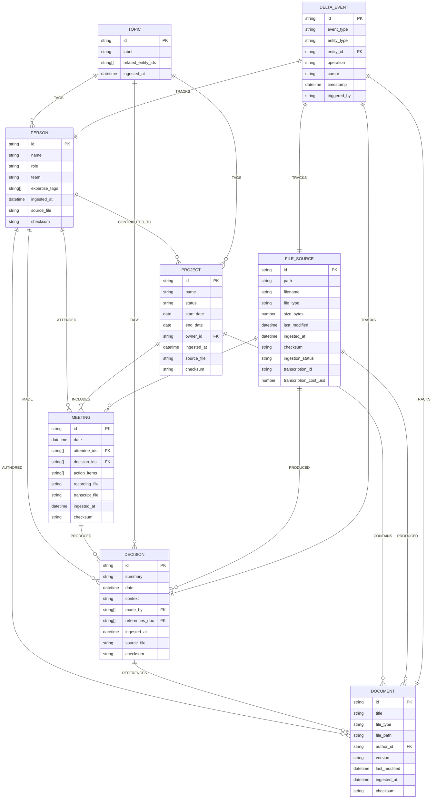

# ATLAS — High-Level Technical Plan
**Version:** 0.4 (Multi-Modal + Folder Widget + Dry Run)
**Status:** Approved for Build
**Last Updated:** 2026-04-22

---

## 1. Problem Statement

Organisational knowledge is fragmented across documents, emails, meeting
recordings, presentations, spreadsheets, and images. It lives in unstructured
folders with no naming conventions, deep nesting, and mixed file types.

When people leave, go on leave, or are simply unavailable, that knowledge
disappears. Everyone rebuilds context from scratch, repeatedly.

Existing tools fail in different ways:
- **NotebookLM:** Stateless — no persistent graph, no entity relationships,
  no cross-document intelligence, no external benchmarking
- **Cowork:** Task execution — does things with files, does not understand them
- **M365 Copilot:** Locked inside Microsoft apps, blocked by Conditional
  Access policies in most enterprise tenants, $30/user/month

**Atlas is a consent-first, filesystem-native workspace intelligence assistant**
that ingests any unstructured folder of files — documents, audio, video,
presentations, emails, images — builds a persistent knowledge graph, and
answers natural language questions with exact citations, augmented by
external industry benchmarks via Genspark.

---

## 2. Core Design Principles

| Principle | What It Means in Practice |
|---|---|
| **User-enablement first** | User inputs the root folder — Atlas ingests from there |
| **Unstructured-native** | No folder structure assumptions — deep recursive crawl |
| **Multi-modal** | Handles text, audio, video, images, presentations, email |
| **Consent by configuration** | Pointing Atlas at a folder is the consent act |
| **Dry-run before commit** | User sees exactly what will be ingested before it happens |
| **You decide on sensitive files** | Atlas flags potentially sensitive files — user approves or skips |
| **Attribution-mandatory** | Every answer cites exact source file, path, timestamp |
| **Policy-as-markdown** | All behaviour governed by skill files — no code changes for updates |
| **Single source of truth** | graph/schema.json is canonical schema — never duplicated |
| **Event-driven mutation** | All graph changes in delta_log.jsonl — no snapshot comparison |

---

## 3. Why Filesystem Ingestion Beats API Connectors

```
M365 API Connector                    Local Filesystem (OneDrive Sync)
──────────────────────────────────    ──────────────────────────────────
Blocked by Conditional Access  ❌     No API calls — nothing to block  ✅
Requires IT admin consent      ❌     User already owns the files      ✅
Tenant-wide policy dependency  ❌     User-level decision only         ✅
Black box to user              ❌     User sees exactly what's ingested ✅
Complex auth flows             ❌     Simple folder path input         ✅
```

**The OneDrive Sync Insight:**
Most M365 users have OneDrive desktop sync running. Their local filesystem
at `C:\Users\[name]\OneDrive - [Org]\` is a live, automatically-updated
mirror of their SharePoint and OneDrive content.

Atlas pointing at this folder gets real org data — updated whenever
SharePoint updates — with zero API calls and zero Conditional Access issues.

```
SharePoint ──► OneDrive Sync ──► Local Filesystem ──► Atlas
(M365 managed)  (automatic)      (Atlas reads here)
```

---

## 4. Whisper API — Audio and Video Transcription

### Pricing (Confirmed April 2026)

| Model | Cost per Minute | Best For |
|---|---|---|
| `whisper-1` | $0.006/min ($0.36/hr) | Standard accuracy |
| `gpt-4o-transcribe` | $0.006/min | Higher accuracy |
| `gpt-4o-mini-transcribe` | $0.003/min ($0.18/hr) | **Recommended — half price** |

**Atlas uses `gpt-4o-mini-transcribe` by default.**

### Cost Reality for Atlas

```
Hackathon demo (3-4 recordings, ~60 min each):   ~$0.72
Full day of testing all features:                ~$3.00
OpenAI free credits on new account:              $5.00
                                                 ──────
Net cost for entire hackathon:                   $0.00
```

**Free credits cover the entire hackathon with room to spare.**

### The 25MB File Size Limit

Whisper API rejects files over 25MB. Atlas handles this automatically:
- Audio files >25MB → split into chunks before API call
- Video files → extract audio track first → then chunk if needed
- Tool: `ffmpeg` (installed via npm package `fluent-ffmpeg`)

### Transcription Output

Every audio/video file produces a transcript stored as:
```json
{
  "source_file": "/recordings/march-steering-committee.mp4",
  "transcript": "[full transcription text]",
  "duration_seconds": 3420,
  "language": "en",
  "model": "gpt-4o-mini-transcribe",
  "cost_usd": 0.342,
  "transcribed_at": "2026-04-22T10:00:00Z"
}
```

This transcript is then fed into the PII Redactor and Entity Extractor
exactly like any other text content.

---

## 5. Supported File Types — Full Multi-Modal Matrix

| Extension | Type | Parser | Signal Quality |
|---|---|---|---|
| `.docx` | Word document | mammoth.js | ⭐⭐⭐⭐⭐ High |
| `.pdf` | PDF | pdf-parse | ⭐⭐⭐⭐ High |
| `.txt` | Plain text | fs.readFile | ⭐⭐⭐ Medium |
| `.pptx` | PowerPoint | pptx-parser | ⭐⭐⭐⭐ High |
| `.xlsx` | Excel | xlsx library | ⭐⭐⭐ Medium |
| `.eml` | Email export | email-parser | ⭐⭐⭐⭐ High |
| `.msg` | Outlook message | msg-parser | ⭐⭐⭐⭐ High |
| `.vtt` | Teams transcript | text parse | ⭐⭐⭐⭐⭐ Highest |
| `.srt` | Subtitle/transcript | text parse | ⭐⭐⭐⭐⭐ Highest |
| `.mp3` | Audio recording | Whisper API | ⭐⭐⭐⭐ High |
| `.m4a` | Audio (Teams) | Whisper API | ⭐⭐⭐⭐ High |
| `.wav` | Audio | Whisper API | ⭐⭐⭐⭐ High |
| `.mp4` | Video recording | Extract audio → Whisper | ⭐⭐⭐⭐ High |
| `.png` | Image/screenshot | Claude Vision API | ⭐⭐⭐ Medium |
| `.jpg` | Image | Claude Vision API | ⭐⭐⭐ Medium |
| `.jpeg` | Image | Claude Vision API | ⭐⭐⭐ Medium |
| `.csv` | Data export | text parse | ⭐⭐ Low |
| `.md` | Markdown notes | text parse | ⭐⭐⭐ Medium |

**Skipped (unsupported):**
`.zip`, `.exe`, `.db`, `.dmg`, `.iso`, encrypted PDFs,
files with no extension, files under 100 bytes (noise)

---

## 6. High-Level Architecture

```
┌──────────────────────────────────────────────────────────────────────┐
│                    ATLAS UI — BROWSER                                │
│                                                                      │
│  ┌─────────────────────────────────────────────────────────────┐    │
│  │  📁 Knowledge Source                                         │    │
│  │  Root Folder: [_________________________________] [Browse]  │    │
│  │  2,847 files · 143 folders · 7.5 GB                        │    │
│  │  [🔍 Dry Run]  [▶ Start Ingestion]                         │    │
│  └─────────────────────────────────────────────────────────────┘    │
│                                                                      │
│  ┌──────────────────────┐  ┌──────────────────────────────────┐     │
│  │  💬 Chat             │  │  ✨ Synthesis                     │     │
│  │  [Ask Atlas...]      │  │  [Podcast|Brief|Handover|...]    │     │
│  │                      │  │  [Topic input...]  [Generate]    │     │
│  │  [Response with      │  │  [Output area + Download .md]    │     │
│  │   citations]         │  ├──────────────────────────────────┤     │
│  │                      │  │  📊 Knowledge Dashboard          │     │
│  │                      │  │  Files ingested: 1,132           │     │
│  │                      │  │  Nodes: 3,847  Edges: 7,203     │     │
│  │                      │  │  Last run: 10 min ago            │     │
│  │                      │  │  [Re-ingest]                     │     │
│  └──────────────────────┘  └──────────────────────────────────┘     │
└──────────────────────────────────────────────────────────────────────┘
                                    │
                                    ▼
┌──────────────────────────────────────────────────────────────────────┐
│                         TIER 1: INGESTION                            │
│                                                                      │
│  Root Folder (user-specified via widget)                             │
│       │                                                              │
│       ▼                                                              │
│  [1] Deep Recursive Crawler                                          │
│      Walks all nested folders, any structure                         │
│      Detects file types, sizes, last_modified                        │
│      Compares against delta_log.jsonl cursor                         │
│      Outputs: changed_files[], skipped[], flagged[]                  │
│                                                                      │
│       │                                                              │
│       ▼                                                              │
│  [2] DRY RUN ENGINE (if dry run requested)                           │
│      Generates full Dry Run Report                                   │
│      Estimates time per file type                                    │
│      Flags sensitive filenames → "You Decide" review screen          │
│      No files processed, no graph written                            │
│      User approves/skips flagged files                               │
│      → User clicks [Start Ingestion] to proceed                      │
│                                                                      │
│       │ (only runs after user approves)                              │
│       ▼                                                              │
│  [3] Multi-Modal File Parser                                         │
│      .docx/.pdf/.txt/.pptx/.xlsx → text extraction                  │
│      .mp3/.m4a/.wav → Whisper API transcription                      │
│      .mp4 → ffmpeg audio extract → Whisper API                      │
│      .vtt/.srt → direct text parse                                   │
│      .png/.jpg → Claude Vision API description                       │
│      .eml/.msg → email header + body parse                           │
│                                                                      │
│       │                                                              │
│       ▼                                                              │
│  [4] PII Redactor                                                    │
│      GREEN/AMBER/RED/BLACK classification                            │
│      RED content blocked before extraction                           │
│                                                                      │
│       │                                                              │
│       ▼                                                              │
│  [5] Entity Extractor                                                │
│      Schema loaded from graph/schema.json at runtime                │
│      Parallel Claude sub-agents via Task tool                        │
│      Signal vs noise filter                                          │
│      Staging → merge → validate → commit                             │
│                                                                      │
│       │                                                              │
│       ▼                                                              │
│  [6] Knowledge Graph Store (local JSON)                              │
│      graph/schema.json   ← SINGLE SOURCE OF TRUTH                   │
│      graph/nodes.json    ← entity nodes                              │
│      graph/edges.json    ← relationships                             │
│      graph/embeddings.json ← vector embeddings                       │
│      logs/delta_log.jsonl  ← CDC event stream                        │
│                                                                      │
└──────────────────────────────────────────────────────────────────────┘
                                    │
┌──────────────────────────────────────────────────────────────────────┐
│                       TIER 2: QUERY & SYNTHESIS                      │
│                                                                      │
│  [7] Query Router → [8] Graph Retriever + Genspark → [9] Synthesiser│
│  [10] Synthesis Agent (podcast, brief, handover, decision log)       │
│                                                                      │
└──────────────────────────────────────────────────────────────────────┘
```

---

## 7. Dry Run Feature — Full Specification

### What Dry Run Does

```
User clicks [Dry Run]
         │
         ▼
Deep crawler walks entire root folder
(metadata only — no file content read)
         │
         ▼
Classifies every file by type and size
Estimates processing time per file
Flags filenames suggesting sensitive content
         │
         ▼
Generates Dry Run Report (no graph written)
         │
         ▼
Shows "You Decide" review screen for flagged files
User approves or skips each flagged file
         │
         ▼
User clicks [Start Ingestion]
Atlas processes approved files only
```

### Dry Run Report — UI Layout

```
┌─────────────────────────────────────────────────────────────────┐
│  🔍 Atlas Dry Run Report                                        │
│  Root: C:\Users\Venkata\OneDrive - Temus\                      │
│  Scanned: April 22 2026, 11:47 PM · 847ms                     │
├──────────────────────────────┬──────────────────────────────────┤
│  FILES DISCOVERED            │  TIME ESTIMATES                  │
│                              │                                  │
│  .docx    142 files  890MB   │  Parsing          ~12 min       │
│  .pdf      89 files  1.2GB   │  Audio transcribe ~34 min       │
│  .pptx     34 files  450MB   │  PII redaction     ~8 min       │
│  .xlsx     67 files  234MB   │  Entity extract   ~47 min       │
│  .mp4       8 files  4.1GB   │  Graph commit      ~5 min       │
│  .mp3      12 files  380MB   │                                  │
│  .vtt      23 files   12MB   │  ⏱ Total: ~1hr 46min            │
│  .eml     445 files  156MB   │                                  │
│  .png      78 files  234MB   │  ℹ️ Subsequent runs faster —    │
│  .txt     234 files   45MB   │  only changed files processed   │
│                              │                                  │
│  SKIPPED (unsupported)       │  COST ESTIMATE                  │
│  .zip  12   .exe  3          │  Audio: 20 files × ~45min       │
│  .db    2   .iso  1          │  = 900 min × $0.003            │
│                              │  = ~$2.70                       │
│  Supported:  1,132 files     │  Other parsing: $0.00           │
│  Skipped:       18 files     │  Total: ~$2.70                  │
├──────────────────────────────┴──────────────────────────────────┤
│  ⚠️  FILES REQUIRING YOUR DECISION (8 files)                    │
│                                                                 │
│  Filename suggests sensitive content. Review before ingesting.  │
│                                                                 │
│  [✓] HR-Performance-Review-2025.docx    147KB  Skip ○ Allow ●  │
│  [✓] Payroll-March-2026.xlsx            234KB  Skip ○ Allow ●  │
│  [✓] Medical-Certificate-James.pdf       89KB  Skip ● Allow ○  │
│  [✓] Disciplinary-Hearing-Notes.docx    203KB  Skip ● Allow ○  │
│  [✓] Salary-Bands-2026.xlsx            156KB  Skip ● Allow ○  │
│  [✓] Employee-Grievance-Q1.pdf          178KB  Skip ● Allow ○  │
│  [✓] Termination-Letter-Template.docx   45KB  Skip ○ Allow ●  │
│  [✓] Insurance-Claims-2025.pdf         892KB  Skip ● Allow ○  │
│                                                                 │
│  ℹ️ Files you Allow will still pass through PII Redactor.      │
│     Content classified RED will be blocked automatically.      │
├─────────────────────────────────────────────────────────────────┤
│  ESTIMATED KNOWLEDGE GRAPH                                      │
│                                                                 │
│  ~2,400 - 3,200 entity nodes                                   │
│  ~4,800 - 6,400 relationships                                  │
│  ~180 MB graph store size                                       │
│                                                                 │
│          [Cancel]  [Save Report]  [Start Ingestion →]          │
└─────────────────────────────────────────────────────────────────┘
```

### Time Estimation Algorithm

```javascript
const PROCESSING_RATES_SECONDS_PER_MB = {
  // Text formats — fast
  '.txt':   0.2,
  '.vtt':   0.2,
  '.srt':   0.2,
  '.csv':   0.3,
  '.md':    0.2,

  // Document formats — medium
  '.docx':  0.8,
  '.pdf':   1.2,
  '.xlsx':  0.5,
  '.eml':   0.3,
  '.msg':   0.4,

  // Rich formats — slower
  '.pptx':  1.0,
  '.png':   1.5,
  '.jpg':   1.5,
  '.jpeg':  1.5,

  // Audio/Video — API-dependent
  // These use duration-based estimate not size-based
  '.mp3':   0.18,  // $0.003/min × 60s = ~0.18s API latency per second of audio
  '.m4a':   0.18,
  '.wav':   0.18,
  '.mp4':   0.25,  // Extra time for audio extraction via ffmpeg
}

// Overhead multipliers applied on top of parsing
const OVERHEAD = {
  pii_redaction:    0.15,  // 15% overhead
  entity_extraction: 0.40, // 40% overhead (Claude sub-agent calls)
  graph_commit:     300,   // flat 5 minutes regardless of size
}

function estimateTime(files) {
  let totalSeconds = 0
  const audioFiles = files.filter(f => isAudioVideo(f.extension))

  // For audio/video — estimate from file size as proxy for duration
  // Rough rule: 1MB of MP3 ≈ 1 minute of audio at 128kbps
  audioFiles.forEach(f => {
    const estimatedMinutes = f.size_mb * 1.0
    totalSeconds += estimatedMinutes * 60 * PROCESSING_RATES_SECONDS_PER_MB[f.extension]
  })

  // For other formats — size-based
  const otherFiles = files.filter(f => !isAudioVideo(f.extension))
  otherFiles.forEach(f => {
    totalSeconds += f.size_mb * PROCESSING_RATES_SECONDS_PER_MB[f.extension] || 1.0
  })

  // Apply overhead
  totalSeconds *= (1 + OVERHEAD.pii_redaction + OVERHEAD.entity_extraction)
  totalSeconds += OVERHEAD.graph_commit

  return totalSeconds
}
```

### Sensitive Filename Detection

```javascript
const SENSITIVE_FILENAME_PATTERNS = [
  /payroll/i,
  /salary/i,
  /compensation/i,
  /performance.review/i,
  /disciplinary/i,
  /termination/i,
  /grievance/i,
  /medical/i,
  /insurance.claim/i,
  /hr.investigation/i,
  /redundancy/i,
  /pip/i,            // Performance Improvement Plan
  /personal.data/i,
  /health.record/i,
]

function flagSensitiveFiles(files) {
  return files.filter(f =>
    SENSITIVE_FILENAME_PATTERNS.some(pattern => pattern.test(f.filename))
  )
}
```

---

## 8. Folder Widget — UI Specification

### Widget Component Behaviour

```
State 1 — Empty (first launch):
┌─────────────────────────────────────────────────────┐
│  📁 Knowledge Source                                │
│                                                     │
│  Point Atlas at a folder to begin                  │
│  ┌───────────────────────────────────┐  [Browse]   │
│  │  Enter folder path or browse...   │             │
│  └───────────────────────────────────┘             │
│                                                     │
│  💡 Tip: Point at your OneDrive sync folder for    │
│     live Microsoft 365 document access             │
└─────────────────────────────────────────────────────┘

State 2 — Path entered, scanning:
┌─────────────────────────────────────────────────────┐
│  📁 Knowledge Source                                │
│  C:\Users\Venkata\OneDrive - Temus\               │
│  ⟳ Scanning...                                     │
└─────────────────────────────────────────────────────┘

State 3 — Scan complete, ready:
┌─────────────────────────────────────────────────────┐
│  📁 Knowledge Source                    [Change]    │
│  C:\Users\Venkata\OneDrive - Temus\               │
│                                                     │
│  ● 2,847 files found · 143 folders                 │
│  ● 1,132 supported · 18 skipped                    │
│  ● 7.5 GB total                                    │
│                                                     │
│  [🔍 Dry Run]          [▶ Start Ingestion]         │
└─────────────────────────────────────────────────────┘

State 4 — Ingestion running:
┌─────────────────────────────────────────────────────┐
│  📁 Knowledge Source                                │
│  C:\Users\Venkata\OneDrive - Temus\               │
│                                                     │
│  ▶ Ingesting... 342 / 1,132 files                  │
│  ████████░░░░░░░░░░░░  30%                         │
│  ⏱ ~1hr 14min remaining                            │
│                                                     │
│  Currently: parsing vendor-selection.docx          │
│                                                     │
│  [Pause]  [Cancel]                                 │
└─────────────────────────────────────────────────────┘
```

### Browse Button Implementation

In browser React, use the native folder picker:

```jsx
<input
  type="file"
  webkitdirectory="true"
  directory="true"
  style={{ display: 'none' }}
  ref={folderInputRef}
  onChange={handleFolderSelect}
/>
<button onClick={() => folderInputRef.current.click()}>
  Browse
</button>
```

Note: `webkitdirectory` gives the browser a list of all files in the
selected folder. The actual file paths are available via the File API.
This works in Chrome and Edge without any additional library.

---

## 9. Entity Relationship Diagram



---

## 10. Component Breakdown

### 10.1 Deep Recursive Crawler
**Governed by:** `skills/ingestion.md`

Walks the user-specified root folder with no structure assumptions.

```javascript
async function crawl(rootPath, lastCursor) {
  const results = {
    changed: [],    // modified after cursor
    unchanged: [],  // checksum matches — skip
    unsupported: [], // extension not in supported list
    flagged: [],    // sensitive filename detected
    errors: []      // permission denied, corrupt, etc
  }
  await walkRecursive(rootPath, results, lastCursor)
  return results
}
```

Key behaviours:
- Handles arbitrary nesting depth (no limit)
- Gracefully skips permission-denied folders
- Detects and skips symlink loops
- Handles filenames with spaces, unicode, emoji
- Skips files under 100 bytes (noise threshold)
- Skips files over 500MB (chunking not yet implemented)

---

### 10.2 Dry Run Engine
**Governed by:** `skills/dry_run.md`

Produces the Dry Run Report without touching any file content.

```javascript
async function dryRun(crawlResults) {
  const report = {
    scanned_at: new Date().toISOString(),
    root_path: config.ingestion_path,
    file_breakdown: groupByExtension(crawlResults.changed),
    skipped: crawlResults.unsupported,
    flagged: crawlResults.flagged,
    time_estimate_seconds: estimateTime(crawlResults.changed),
    cost_estimate_usd: estimateCost(crawlResults.changed),
    graph_size_estimate: estimateGraphSize(crawlResults.changed)
  }
  return report
}
```

The "You Decide" review screen:
- Shows every flagged file (sensitive filename pattern match)
- Default: Skip (safer default)
- User can toggle each file to Allow
- Files set to Allow still pass through PII Redactor
  — RED content blocked automatically even if user allowed the file
- User decision logged to audit_log.jsonl before ingestion starts

---

### 10.3 Multi-Modal File Parser
**Governed by:** `skills/ingestion.md`

Routes each file to the correct parser based on extension.

```javascript
const PARSER_MAP = {
  // Documents
  '.docx': (path) => mammoth.extractRawText({ path }),
  '.pdf':  (path) => pdfParse(fs.readFileSync(path)),
  '.txt':  (path) => fs.readFileSync(path, 'utf8'),
  '.xlsx': (path) => xlsxToText(path),
  '.csv':  (path) => fs.readFileSync(path, 'utf8'),
  '.md':   (path) => fs.readFileSync(path, 'utf8'),

  // Presentations
  '.pptx': (path) => pptxExtractText(path),

  // Email
  '.eml':  (path) => emailParser.parse(fs.readFileSync(path, 'utf8')),
  '.msg':  (path) => msgParser.parse(path),

  // Transcripts (already text)
  '.vtt':  (path) => vttToText(path),
  '.srt':  (path) => srtToText(path),

  // Audio — Whisper API
  '.mp3':  (path) => transcribeAudio(path),
  '.m4a':  (path) => transcribeAudio(path),
  '.wav':  (path) => transcribeAudio(path),

  // Video — extract audio first, then Whisper
  '.mp4':  (path) => extractAudioThenTranscribe(path),

  // Images — Claude Vision
  '.png':  (path) => describeImage(path),
  '.jpg':  (path) => describeImage(path),
  '.jpeg': (path) => describeImage(path),
}

async function transcribeAudio(filePath) {
  // Check file size — chunk if > 25MB
  const stats = fs.statSync(filePath)
  if (stats.size > 25 * 1024 * 1024) {
    return transcribeInChunks(filePath)
  }
  const response = await openai.audio.transcriptions.create({
    file: fs.createReadStream(filePath),
    model: 'gpt-4o-mini-transcribe', // cheaper — $0.003/min
    response_format: 'text'
  })
  return response
}

async function extractAudioThenTranscribe(videoPath) {
  const audioPath = videoPath.replace(/\.mp4$/, '_audio.mp3')
  await ffmpeg(videoPath)
    .noVideo()
    .audioCodec('libmp3lame')
    .save(audioPath)
  const transcript = await transcribeAudio(audioPath)
  fs.unlinkSync(audioPath) // clean up temp file
  return transcript
}

async function describeImage(imagePath) {
  const base64 = fs.readFileSync(imagePath).toString('base64')
  const response = await anthropic.messages.create({
    model: 'claude-sonnet-4-20250514',
    messages: [{
      role: 'user',
      content: [{
        type: 'image',
        source: { type: 'base64',
                  media_type: 'image/png', data: base64 }
      }, {
        type: 'text',
        text: 'Describe all text, diagrams, charts, and information visible in this image. Focus on extracting any decisions, project information, people, dates, or outcomes.'
      }]
    }]
  })
  return response.content[0].text
}
```

---

### 10.4 PII Redactor
**Governed by:** `skills/pii_redactor.md`
**Inherits from:** `skills/governance.md`

Unchanged from v0.3. Runs on all parsed content regardless of source format.

---

### 10.5 Entity Extractor
**Governed by:** `skills/entity_extractor.md`
**Schema loaded at runtime from:** `graph/schema.json`

Unchanged from v0.3. Runs after PII redaction on clean text.

---

### 10.6 Knowledge Graph Store + Delta Tracker
**Governed by:** `skills/graph_store.md`

Unchanged from v0.3. CDC via delta_log.jsonl, cursor-based incremental updates.

---

### 10.7 Query Router
**Governed by:** `skills/query_router.md`

Unchanged from v0.3.

---

### 10.8 Genspark Integration

Unchanged from v0.3. Claude web search as fallback.

---

### 10.9 Response Synthesiser
**Governed by:** `skills/response_synth.md`

Mandatory output template — every response:
```
[Natural language answer]

─── Internal Sources ──────────────────────────────
• [filename] | [file type] | [author] | [date] | [path]

─── External Research (via Genspark) ──────────────
• [source] | [URL] | [retrieved: date]
  (omitted if Genspark not activated)

─── Knowledge Base Transparency ───────────────────
Root folder: [path]
Files accessed: [count]
Last ingestion: [timestamp]
Audio transcription cost this session: $[amount]
```

---

### 10.10 Synthesis Agent
**Governed by:** `skills/synthesis_agent.md`

Enhanced for multi-modal — synthesis agent now references
audio transcripts and image descriptions alongside documents.

| Command | Output | Multi-Modal Benefit |
|---|---|---|
| `Produce podcast script` | Two-voice dialogue | Uses meeting recordings as primary source |
| `Synthesise project brief` | Structured document | Includes slide content from .pptx files |
| `Generate onboarding guide` | New-employee guide | Draws from recorded walkthroughs |
| `Create decision log` | Chronological decisions | Includes verbal decisions from meeting transcripts |
| `Draft handover document` | Role context transfer | Combines written + verbal contributions |
| `Generate benchmark report` | Internal vs industry | Graph + Genspark |

---

## 11. Skill Files

```
skills/governance.md      ← master rules — ALL skills inherit from this
    ├── skills/ingestion.md        ← deep crawler + multi-modal parser rules
    ├── skills/dry_run.md          ← NEW dry run engine rules
    ├── skills/pii_redactor.md     ← classification + transformation
    ├── skills/entity_extractor.md ← extraction (refs schema.json at runtime)
    ├── skills/graph_store.md      ← CDC + persistence
    ├── skills/query_router.md     ← routing + refusal
    ├── skills/response_synth.md   ← mandatory citation template
    └── skills/synthesis_agent.md  ← artefact generation
```

---

## 12. Technology Stack

| Layer | Technology | Notes |
|---|---|---|
| **AI Reasoning** | Claude via Claude Code + claude.ai | Primary intelligence |
| **Audio Transcription** | OpenAI `gpt-4o-mini-transcribe` | $0.003/min — cheapest accurate option |
| **Video Processing** | ffmpeg via fluent-ffmpeg npm | Audio extraction before transcription |
| **Image Understanding** | Claude Vision API | Describes diagrams, screenshots, charts |
| **Document Parsing** | mammoth.js, pdf-parse, pptx-parser, xlsx | Format-specific extraction |
| **Email Parsing** | email-parser, msg-parser | .eml and .msg support |
| **Transcript Parsing** | Custom VTT/SRT parser | Teams transcripts |
| **External Research** | Genspark API (Claude web search fallback) | Benchmarking |
| **Graph Store** | Local JSON files | Portable, zero infrastructure |
| **CDC Tracking** | delta_log.jsonl append-only | Cursor-based incremental |
| **Build Environment** | Claude Code in Google IDX | Agentic development |
| **UI** | React in browser | webkitdirectory for folder picker |
| **Runtime** | Node.js 22 | Claude Code ecosystem |

---

## 13. Cost Model

### Hackathon (Demo Scale)
```
Whisper transcription (4 recordings × 60min):    $0.72
Claude Vision (20 images):                       $0.10
Genspark API (10 queries):                       ~$0.50
Total:                                           ~$1.32
OpenAI free credits on new account:              $5.00
Net cost:                                        $0.00
```

### Production (Per User Per Month)
```
Scenario: Power user, 500 documents, 10 hours audio/month
Whisper:  600 min × $0.003 =                    $1.80
Vision:   50 images × ~$0.005 =                 $0.25
Genspark: 100 queries =                         ~$5.00
Claude:   Included in Atlas subscription
Total API costs per user:                       ~$7.05/month
Suggested Atlas pricing:                        $25-40/user/month
Gross margin:                                   ~75%
```

---

## 14. Known Gaps and Risks

| Gap | Impact | Hackathon Mitigation | Production Fix |
|---|---|---|---|
| **25MB Whisper limit** | Large recordings fail | Auto-chunk via ffmpeg | Built into parser |
| **ffmpeg dependency** | Must be installed separately | Include in setup script | Bundle with app |
| **Browser file path access** | webkitdirectory gives File objects not paths | Use File API to read content directly | Electron app for full path access |
| **Large folder scan time** | 10k+ files takes minutes to crawl | Show progress spinner | Incremental background scan |
| **Image extraction quality** | Vision API misses hand-drawn diagrams | Acceptable for demo | Fine-tuned vision model |
| **Encrypted PDFs** | Cannot parse | Skip with clear message to user | Commercial PDF SDK |
| **JSON at scale** | Slow beyond ~100k nodes | Fine for hackathon | Neo4j + Weaviate |
| **Concurrent file parsing** | Rate limits on Whisper/Vision APIs | Queue with concurrency limit of 3 | Proper job queue |

---

## 15. Deployment Tiers

### Tier 1 — Personal (Immediate, No IT)
Any user, any folder, any files they have on their machine.
Works today. No approval needed.

### Tier 2 — Team (OneDrive Sync)
Team members point Atlas at shared OneDrive sync folder.
Everyone ingests the same shared content.
Graphs mergeable with consent.

### Tier 3 — Enterprise (IT-Sanctioned)
Atlas deployed as approved enterprise application.
M365 connector enabled where Conditional Access permits.
Centralised graph with role-based query scoping.
Full audit trail for ISO 27001 / SOC 2 / PDPA compliance.

---

## 16. Build Sequence (10-Hour Day)

| Hour | Phase | Deliverable |
|---|---|---|
| 0 | Scaffold | Project structure, all skill files, schema.json |
| 1 | Deep Crawler + Dry Run Engine | Folder scanning, time estimates, sensitivity flagging |
| 2 | Multi-Modal File Parser | All 18 file formats parsed to clean text |
| 3 | PII Redactor | Classification + transformation pipeline |
| 4 | Entity Extractor | Schema-driven parallel extraction |
| 5 | Graph Store + Delta Tracker | CDC events, incremental ingestion |
| 6 | Query Router + Response Synthesiser | Routing, refusal, citation template |
| 7 | Genspark Integration | External research augmentation |
| 8 | Synthesis Agent | Podcast, brief, handover — hero features |
| 9 | Demo UI | Folder widget + dry run UI + chat + synthesis + dashboard |
| 10 | Pitch Prep | Demo script, one-pager, judge Q&A |

---

## 17. Resolved Decisions

| # | Decision |
|---|---|
| Ingestion mechanism | Local filesystem — deep recursive crawl, any structure |
| Audio/Video | OpenAI `gpt-4o-mini-transcribe` at $0.003/min |
| Image understanding | Claude Vision API |
| Sensitive files | "You Decide" — user approves or skips per file, PII Redactor still runs |
| Folder input | Browser widget with webkitdirectory picker + manual path input |
| Dry run | Full report with time/cost estimates before any ingestion |
| Schema source of truth | graph/schema.json — loaded at runtime, never duplicated |
| CDC mechanism | delta_log.jsonl cursor-based — no snapshot comparison |
| Graph storage | Local JSON files — portable, zero infrastructure |
| Genspark fallback | Claude web search tool if API unavailable |
| Demo data | User points Atlas at any real folder — no pre-seeding needed |

---

## 18. Complete File Map

```
atlas/
├── ATLAS_PLAN.md
├── CLAUDE.md
├── README.md
├── .env.example
├── .gitignore
├── claude_mcp_config.json
├── package.json
│
├── config/
│   └── ingestion_config.json
│
├── graph/
│   └── schema.json              ← SINGLE SOURCE OF TRUTH
│
├── logs/
│   └── .gitkeep
│
├── skills/
│   ├── governance.md
│   ├── ingestion.md
│   ├── dry_run.md               ← NEW
│   ├── pii_redactor.md
│   ├── entity_extractor.md
│   ├── graph_store.md
│   ├── query_router.md
│   ├── response_synth.md
│   └── synthesis_agent.md
│
├── src/
│   ├── ingestion/
│   │   ├── crawler.js           ← deep recursive crawler
│   │   ├── dry_run.js           ← dry run engine
│   │   ├── file_parser.js       ← multi-modal parser
│   │   ├── audio_transcriber.js ← Whisper API + chunking
│   │   ├── video_processor.js   ← ffmpeg + transcribe
│   │   ├── image_describer.js   ← Claude Vision API
│   │   ├── pii_redactor.js
│   │   └── entity_extractor.js
│   ├── graph/
│   │   ├── graph_store.js
│   │   └── delta_tracker.js
│   ├── query/
│   │   ├── query_router.js
│   │   └── response_synth.js
│   ├── synthesis/
│   │   ├── podcast_writer.js
│   │   ├── brief_generator.js
│   │   ├── handover_builder.js
│   │   └── benchmark_reporter.js
│   └── ui/
│       └── atlas_interface.jsx
│
└── tests/
    ├── crawler.test.js
    ├── dry_run.test.js
    ├── file_parser.test.js
    ├── pii_redactor.test.js
    └── entity_extractor.test.js
```

---

*Version 0.4 — Multi-modal ingestion, folder widget, dry run feature.*
*Whisper API at $0.003/min for audio. Claude Vision for images.*
*"You Decide" review for sensitive files before ingestion.*
*All other architectural decisions from v0.3 unchanged.*
